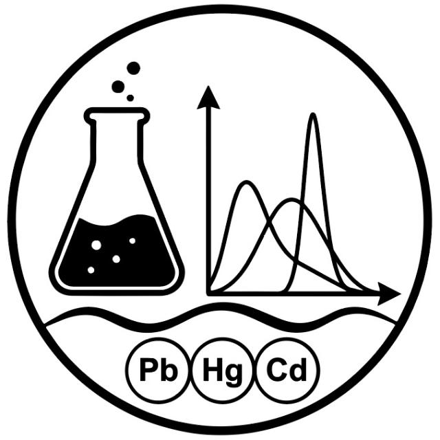

<div align="center">



# HeavyStats

**Statistical framework for heavy metals biomonitoring, toxicological epidemiology, and pediatric health analytics.**

[](https://pypi.org/project/heavystats/)
[](https://pypi.org/project/heavystats/)
[](https://opensource.org/licenses/MIT)
[](https://peps.python.org/pep-0008/)
[](https://peps.python.org/pep-0561/)

---

*Paquete estadístico integral en Python para el análisis, control de calidad, bioestadística univariante/bivariante y estratificación de riesgo toxicológico por metales pesados (Plomo, Mercurio, Cadmio, Arsénico, etc.) en salud infantil y poblaciones vulnerables.*

</div>

---

## 🌟 Características Principales

- **🖥️ HeavyStats Studio & CLI**: Entorno de terminal interactivo (TUI con Textual) y generador automatizado de proyectos y cuadernos de análisis reproducibles por metal (Plomo, Mercurio, Cadmio).
- **🔬 Control de Calidad Automatizado**: Validación metodológica de datos biológicos (límites de detección LOD, rangos plausibles, consistencia antropométrica según CDC/OMS).
- **🧹 Preprocesamiento Epidemiológico**: Limpieza de encuestas, desagregación de respuestas múltiples, estandarización de frecuencias dietéticas e indicadores compuestos de vulnerabilidad.
- **📊 Análisis Univariante con Calidad de Publicación**: Generación de tablas formateadas (estilo APA/médico) con visualización interactiva HTML forzada en modo claro, exportables a Excel, CSV y LaTeX.
- **📈 Bioestadística Bivariante No Paramétrica**:
  - Pruebas de hipótesis: Mann-Whitney U, Kruskal-Wallis, Dunn *post-hoc*, Jonckheere-Terpstra (tendencia ordenada).
  - Correlación y colinealidad: Matrices de Spearman, correlaciones pareadas, Chi-cuadrado y Fisher.
  - Métodos robustos: Estimador de Hodges-Lehmann, intervalos de confianza Bootstrap para diferencias de medianas.
  - Control de tasa de falsos descubrimientos (FDR / Benjamini-Hochberg, Bonferroni, Holm).
- **🛡️ Comparación Poblacional y Algoritmo de Riesgo**: Comparación de sectores expuestos vs. control con categorización de riesgo toxicológico pediátrico.

---

## 📦 Instalación

Instala la versión estable directamente desde PyPI con `pip`:

```bash
pip install heavystats
```

O si utilizas `uv`:

```bash
uv add heavystats
```

---

## 🖥️ HeavyStats Studio (TUI & CLI)

HeavyStats incluye un estudio interactivo de terminal para inicializar y estructurar automáticamente proyectos completos de bioanálisis con sus carpetas analíticas y 6 cuadernos reproducibles listos para ejecutar.

### Ejecución con `uv`

```bash
# Iniciar la interfaz visual interactiva de terminal (TUI)
uv run heavystats

# Comando alternativo equivalente
uv run heavystats-studio

# Ejecución directa para un metal específico (modo headless / consola)
uv run heavystats -m plomo --no-tui
uv run heavystats -m mercurio --no-tui
uv run heavystats -m cadmio --no-tui

# Consultar opciones y ayuda del CLI
uv run heavystats --help
```

### Iniciar desde Python

```python
import heavystats as hs

# Lanza la interfaz gráfica interactiva de terminal
hs.launch_studio()
```

### Estructura Generada por el Studio

Al inicializar un análisis para un metal, se crea la estructura estándar de investigación:

```text
├── datos/
│   ├── datos_{metal}.csv
│   └── procesados/
├── salidas/
│   ├── control_calidad/
│   ├── univariante/
│   │   ├── tablas/
│   │   └── graficos/
│   └── bivariante/
│       ├── tablas/
│       └── graficos/
├── validacion.ipynb
├── filtros.ipynb
├── univariante/
│   ├── 01_tablas.ipynb
│   └── 02_graficos.ipynb
└── bivariante/
    ├── 01_analisis_estadistico.ipynb
    └── 02_graficos_bivariantes.ipynb
```

---

## 🚀 Guía de Inicio Rápido en Python (Quickstart)

### 1. Carga y Control de Calidad de Datos

```python
import heavystats as hs

# Carga de datos (utiliza el dataset de muestra integrado si no se especifica ruta)
df = hs.load_data()

# Ejecución del control de calidad metodológico
reporte_val = hs.validate_data(df)

# Visualización del reporte en Jupyter / VSCode / Positron
reporte_val.show()

# Exportación a Excel y texto
reporte_val.to_excel("reporte_calidad.xlsx")
reporte_val.to_text("reporte_calidad.txt")
```

---

### 2. Análisis Univariante

Generación de tablas y gráficos descriptivos para biomarcadores y variables sociodemográficas:

```python
from heavystats.univariate import UnivariateTables, UnivariatePlots

# Tablas descriptivas de metales pesados con percentiles y límites CDC/OMS
tables = UnivariateTables(df)
tabla_metales = tables.metals_table()
tabla_metales.show()

# Exportar tabla formateada
tabla_metales.to_excel("tabla_univariante_metales.xlsx")

# Gráficos descriptivos (Histogramas, KDE, Boxplots)
plots = UnivariatePlots(df)
fig = plots.plot_distribution("Plomo_Sangre")
```

---

### 3. Análisis Bivariante y Pruebas No Paramétricas

```python
from heavystats.bivariate import (
    BivariateTables,
    BivariatePlots,
    mann_whitney_test,
    kruskal_wallis_test,
    spearman_matrix,
    rank_bivariate_associations,
)

# Comparación entre dos grupos independientes (ej. Sector A vs Sector B)
mw_result = mann_whitney_test(
    df=df,
    group_col="Sector",
    val_col="Plomo_Sangre",
    group_a="Sector_1",
    group_b="Sector_2"
)
print(mw_result)

# Matriz de correlación de Spearman entre metales pesados
matriz_corr = spearman_matrix(df, metal_cols=["Plomo_Sangre", "Mercurio_Sangre", "Cadmio_Sangre"])
matriz_corr.show()

# Ranking de factores de riesgo asociados a niveles elevados de plomo
ranking = rank_bivariate_associations(df, outcome_col="Plomo_Sangre")
ranking.show()
```

---

### 4. Comparación de Grupos y Estratificación de Riesgo

```python
from heavystats import compare_groups

# Comparación integral de sectores frente a límites toxicológicos
comp_report = compare_groups(df, group_col="Sector", metal_col="Plomo_Sangre")
comp_report.show()
comp_report.to_excel("comparacion_sectores.xlsx")
```

---

## 📋 Módulos de la Librería

| Módulo | Descripción |
| :--- | :--- |
| `heavystats.studio` | Entorno interactivo de terminal (TUI) y generador automatizado de proyectos bioestadísticos. |
| `heavystats.cli` | Punto de entrada unificado por línea de comandos para el comando `heavystats`. |
| `heavystats.validation` | Reglas de validación biológica, rangos plausibles y generación de reportes de calidad. |
| `heavystats.cleaning` | Limpieza, decodificación, tipificación de variables e ingeniería de indicadores compuestos. |
| `heavystats.univariate` | Estadísticos descriptivos robustos, percentiles de referencia, tablas APA y gráficos de distribución. |
| `heavystats.bivariate` | Tests no paramétricos (Mann-Whitney, Kruskal-Wallis, Dunn), correlaciones de Spearman y análisis de colinealidad. |
| `heavystats.comparation` | Comparación poblacional de riesgo y análisis de exposición por sectores. |
| `heavystats.html_utils` | Motor de renderizado HTML con soporte forzado para visualización clara en temas oscuros y claros. |

---

## 🧪 Pruebas Automatizadas

Para ejecutar la suite de pruebas unitarias con `pytest`:

```bash
uv run pytest tests/ -v
```

---

## 📖 Cita y Referencias

Si utilizas `heavystats` en tus investigaciones científicas, tesis o reportes de salud pública, por favor cita la librería:

```bibtex
@software{heavystats2026,
  author = {Alvarez, Estrada},
  title = {HeavyStats: Statistical framework for heavy metals biomonitoring and pediatric epidemiology},
  year = {2026},
  version = {0.4.0},
  url = {https://github.com/estralvarez/HeavyStats}
}
```

---

## 📄 Licencia

Este proyecto está bajo la Licencia **MIT**. Consulta el archivo [LICENSE](LICENSE) para más detalles.
